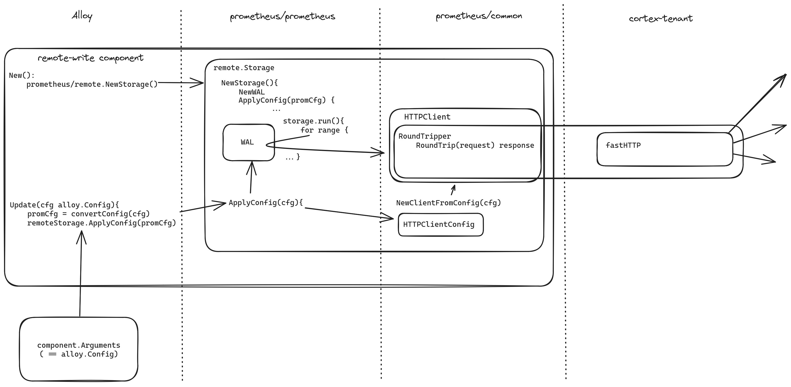

# Cortex-tenant integration proof-of-concept

The main aim of this proof of concept is to integrate the feature of multi-tenancy
from cortex-tenant inside of Alloy.

The trick used with this PoC is to rely on being able to customize the RoundTripper
used by the prometheus HTTPClient when executing Remote-Write calls. If we can
customize this RoundTripper, we can replace it by a custom RoundTripper that
wraps cortex-tenant.

## Detailed description of the modifications in the PoC

There are 3 areas that need modification :
* The prometheus HTTP Client configuration in the github.com/prometheus/common/config package to add the customization of the RoundTripper
* The alloy configuration to add tenant customization configuration and the associated conversion of this config to the suitable prometheus config
* The RoundTripper that wraps cortex-tenant. As cortex-tenant doesn't use the standard http lib but the fasthttp lib instead, either a net/http -> fasthttp is needed or a rewrite of the main cortex-tenant feature using the net/http lib instead of fasthttp.

## Possible improvements

* Most likely, it would be better to re-implement the feature of cortex-tenant within alloy. This would allow better control over this feature and better interfacing with the rest of alloy.
* While the custom RoundTripper is a dirty trick, it could be exploited to reserialize the content of a remote-write in whatever data structure alloy uses to transfer data between components. This means that we could output from a remote-write component to any other component taking metrics as input. Although I'm not sure if this would be useful for anything...

## Links to area of the code of interest

**Be sure to clone all the required repo in the same folder so the following links work**

* function creating the remote-write component in alloy [../alloy/internal/component/prometheus/remotewrite/remote_write.go#68](../alloy/internal/component/prometheus/remotewrite/remote_write.go#68)
  * This function is responsible for instantiating and running remote-write storage from prometheus by calling the remote.NewStorage() function
* function applying the config for the remote-write component in alloy [../alloy/internal/component/prometheus/remotewrite/remote_write.go#252](../alloy/internal/component/prometheus/remotewrite/remote_write.go#252)
* file containing alloy configs and conversion functions to prometheus config [../alloy/internal/component/common/config/types.go](../alloy/internal/component/common/config/types.go)
* HTTPClientConfig structure definintion in prometheus/common [../common/config/http_config.go#289](../common/config/http_config.go#289)
  * Which is created using the `NewClientFromConfig` function [../common/config/http_config.go#495](../common/config/http_config.go#495)
  * The added `WithRoundTripper` function that adds the custom RoundTripper as an HTTPClientOption [../common/config/http_config.go#439](../common/config/http_config.go#439)
    * This is the function to call in the alloy config conversion function to add the custom RoundTripper wrapping cortex-tenant
* Most of the processing of cortex-tenant happens in the handler in [../cortex-tenant/processor.go#146](../cortex-tenant/processor.go#146)
* `replace` instructions in alloy's go.mod : [../alloy/go.mod#740](../alloy/go.mod#740)

## Note of the author on the POC

There is no denying that the solution proposed in this POC is quite a dirty hack.
But considering the [alternatives proposed before](https://github.com/grafana/agent/pull/2583/files),
I feel that this solution is worth discussing.

I want to explicitly point out that with this solution, we proceed to serialize the remote-write request from prometheus only to immediately deserialize
them for routing with cortex-tenant. This is indeed inefficient, but I can't think of a solution to prevent this. Suggestions welcome.

